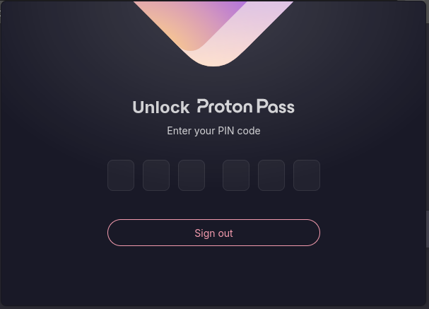
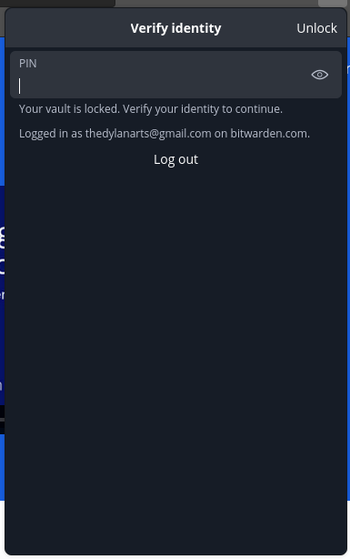

# Cybersecurity is Important -- Password Managers can Help

2024-01-15

If you just want to know how to set up a password manager, go read my post [here](https://mnsr.win/password-manager-setup/).

Cybersecurity is a very popular topic these days. With companies making the news almost every week having some sort of data leak or cyber attack, it is a subject one should rightfully be concerned about. Unfortunately, most are not as concerned or as aware as I think they should be. 

It is difficult to find information about cybersecurity. Almost every post on it on the internet is made by a company that is trying to sell you something. While there can be (and often is) good information in these posts, you know the information is being presented to you to get your money, not keep you safe. Again, this is not even a bad thing, but I believe it still has an effect on the reader. 

So, before we go any further, let me tell you about our sponsor, NordVP- (just kidding <s>Proton please sponsor me</s>).

## It isn't hard (Seriously)

There are two things you can do to bolster your online security:

1. Use a unique, random password for each website
2. Use Two-Factor Authentication (2FA) everywhere possible (especially social media, email, and banking accounts)

The issue with the former is human brains are not meant to randomly generate and remember tens of passwords. Since memorization is impractical, we do the predictable thing... use one password for everything. Even if that one password is a "good password", it is still everywhere. If any service who has that password just so happens to be storing it in plain text gets hacked, guess what? That password is now in hacker databases likely tied to your email. It is only a matter of time before someone starts trying your user info on other services and gets into one of your accounts. 

This means that password managers are just a necessary evil. Password managers act as the one secure place you store all of your passwords. Instead of writing them down on a piece of paper under your keyboard, or worse, put them in some cloud synced notes application, the password manager stores all of your passwords safely in one place and gives you easy access to them. The achilles' heel in this whole plan is your "Master password", the single password that protects your vault. Below, I will discuss a few password manager options, and then I will send you to my next post to show you how to set up a password manager. 

## Bad Password Managers

The idea of a password manager scares those who know enough about security to know not to share their passwords, I mean, think about it. "Hey can you put all of your passwords in a spreadsheet and upload it to our servers?", that is essentially what you are doing with a password manager (unless you are using [KeePassXC](https://keepassxc.org)). BUT! There are password managers you can trust, it is just important to use one of them... instead of a creepy one. 

Here are a few I would never even consider:

1. LastPass 🤮
2. Anything built-in to any browser
3. McAfee Password Manger
4. Anything that isn't open source

## Good Password Managers

A good password manger is the one that offers the features you want, without compromising on security. The password managers mentioned above are ones that [have massive data breaches](https://www.cnet.com/tech/services-and-software/still-using-lastpass-you-need-to-do-these-5-things/), are unencrypted, ran by a company I wouldn't trust with anything, or just general bad practice. 

There are two password managers I have extensive experience with and would recommend to anyone who doesn't have one. Also, let me just say that picking a password manager (if it is a good one) is not a permanent decision. Most password managers allow you to export your passwords just like the allow you to import them, meaning once you have your passwords in a way that one password manager can read them, most others will be able to read them too. Password manager hopping is actually super easy, and takes me about 3 minutes once the password manager itself is setup. So, without further adieu, my favorite password managers: [Bitwarden](https://bitwarden.com/) and [Proton Pass](https://proton.me/pass). 

### Bitwarden: the affordable, simple option

[Bitwarden](https://bitwarden.com/) is probably the number one password manager that comes to mind when you say you strictly want an open source password manager. They have been around for a while and have always been know for transparency and security. Bitwarden also has a free plan that offers all of the major features one would expect from a password manager. Bitwarden is also active in the login security community, participating in efforts to make passkeys more common and useful for users. If you decide to pay for Bitwarden, which I recommend after using it for a few weeks to make sure you like it, the subscription is $10 (USD) per year (or $40 per year for 6 users). The subscription gives you access to the Bitwarden Authenticator, Bitwarden's 2FA manager built directly into your password manager. And a few more nice to have features, like secure file uploads, security reports, and emergency access. 

### Proton Pass: the powerful, integrated option

Not to [doot](https://iv.ggtyler.dev/watch?v=WTWyosdkx44) Proton's horn, but I will start by saying that Proton Pass just looks plain better than Bitwarden. 

Proton Pass browser extension locked

Bitwarden browser extension locked

[Proton Pass](https://proton.me/pass) is a newer entry to the password manager space. It is made by the same team who made Proton Mail, the encrypted and secure email service that doesn't spy on you. Just because it is new doesn't make it worse. I have used each extensively in both Chrome (Brave) and Firefox as well as their Android apps and I think that Proton Pass's auto fill just works better in all cases. The free Proton Pass plan allows you to store 2FA keys, which I think is important, and also gives you access to 10 "*hide-my-email* aliases". Email aliases are a unique approach that Proton has engineered and I haven't seen anything quite like it. Basically, using their tooling from [SimpleLogin](https://simplelogin.io/), Proton Pass can generate an email address for you to give websites when signing up. This alias points to Proton's servers and when an email is sent to that address, it immediately gets redirected to your inbox. When that company inevitably either sells/leaks your email address and it starts getting spammed with ads, you can just go to your dashboard and disable (or delete) the address. Boom. No more email spam. It is just gone. Unfortunately, if you are only looking for a password manager, Proton Pass may not be for you. Proton Pass works best (and is a better deal) if it is bought in a Proton Mail bundle, which includes Mail, Calendar, Drive, VPN and Pass. However, as a Proton Family Plan user myself, I highly recommend looking into protecting yourself and those you love with Proton. 

## What about KeePass/KeePassXC?

KeePass (and its fork, KeePassXC) is a great password manager that I really love a lot. It takes a little different approach to managing passwords than pretty much any other password manager. KeePass is an *offline* password manager. KeePass doesn't have some server somewhere that you put your passwords in. Instead, it is up to you to manage the password database. This gives you maximum control over your data, and you can even make your own KeePass server to get a similar experience to using the cloud. However, it is a lot more technical than one of the other plug-and-play password managers. You are also *very responsible* for your passwords. If you loose your database... your done. Gone. Just plain out of luck. There is nothing anyone anywhere can do about that. With online password managers, you can set recovery methods to get into your account in case you misplace your password. If a natural disaster hits your house, the cloud password managers will be unaffected and you will still have all of your logins. 

Part of me wants to rent a Virtual Private Server (VPS) and run my own KeePass server, but man, Proton Pass (my current password manager) is so nice and easy to use. 

## What about 1Password?

This is a more technical topic, but in short I do not recommend [1Password since they are not interested in open sourcing their client applications](https://1password.community/discussion/comment/114870/#Comment_114870). While their intentions seem sincere, my personal biases lead me to be more skeptical when you won't trust me to read the code that is running on my computer. Trust in IT is bad. Never trust developers and companies. The password managers I mentioned above allow the user to review the software, reducing trust placed in the developers of the project. 

## Conclusion

So! Now you know a lot about password managers, why they are important, and which ones you can look into. Now, if you are ready to dive in and set up your password manager, then just click this [link](https://mnsr.win/password-manager-setup) to follow my guide on setting up Bitwarden. 